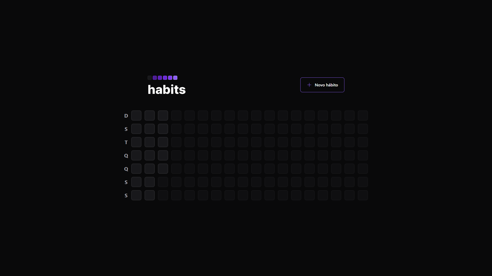

# Habits app

## Resumo:
Aplicativo desenvolvido no evento Nlw Setup da rocketseat.

## Funcionalidades:

- Criar habit
- Listar habits

## Screenshots:
 
mobile app

 
web app

 
backend api

[import to insomnia](./devops/Insomnia_2023-01-19.json)
 

## Aprendizado: 
- typescript - superset do javascript para tipagem(backend, mobile, web)
- tsc - transpilador typescript para javascript(backend)
- fastify/cors - para permissão de requisição de origens customizadas(backend)
- fastify - para desenvolvimento de serviços http(backend)
- expo - para desenvolvimento multiplataforma de aplicativos moveis.(mobile)
- prisma - para manipulação de banco de dados.(backend)
- dayjs - para manipulação de datas.(mobile, web, backend)
- react-native-svg - para renderização de svg(mobile)
- react-native-svg-transformer - para transformação de svg em componentes para ser usavel no react-native.(mobile)
- nativewind - para usar tailwindcss no react-native(mobile)
- prisma-erd-generator - para criar diagramas(backend)
- tailwind - para usar estilos preprontos no frontend(mobile, web)
- phosphor-react - biblioteca de icones(web)
- vite - gerenciador de bundler ultrarapido(web)
- zod - validador de entrada de dados(backend)
## Testes: 
### Server

- 1 `$ cd server `
- 2 `$ npm install `
- 3 `$ npm run dev`

### Web

- 1 `$ cd web `
- 2 `$ npm install `
- 3 `$ npm run dev`

### Mobile

- 1 `$ cd mobile `
- 2 `$ npm install `
- 3 `$ npm run start`
- 4 fazer download do Expo Go no iphone ou android e escanear o codigo Qr.
